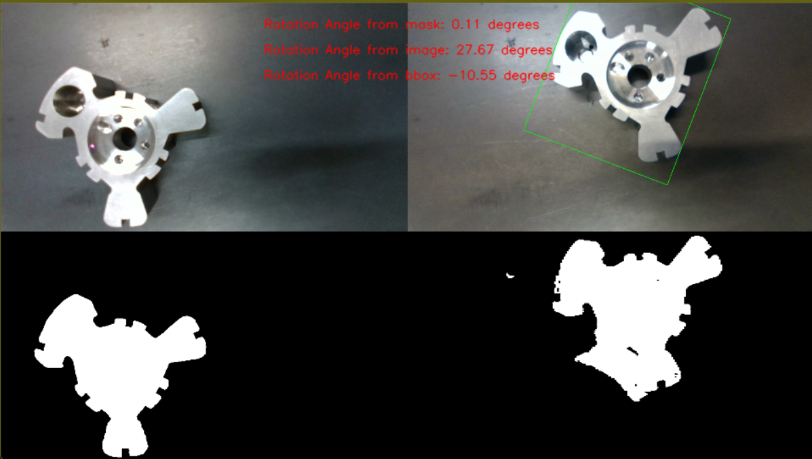

# 2D Object Orientation Detection

## Objective
The goal of this project is to detect the orientation of an object in a 2D plane. Given template images of the object of interest, the program finds the object in the test images and determines the rotation angle between the object in the template image and the object in the test images.

## Project Structure
1. **Train a Segmentation Model**: A UNet model is trained to segment the object of interest from template images.
2. **Create Masks for Test Images**: The trained UNet model is used to create masks for the test images.
3. **Calculate Rotation Angle**: The rotation angle between the object in the template and test images is calculated, and a bounding box is drawn around the object in the test image.

## Folders
- `Template`: Contains template images of the object of interest.
- `Mask`: Contains mask images corresponding to the template images.
- `test`: Contains test images where the object of interest needs to be detected.
- `test_mask`: Contains generated masks for the test images.
- `Model`: Contains the trained model checkpoints and metrics.

## Requirements
- Python 3.x
- TensorFlow
- Keras
- OpenCV
- NumPy
- Matplotlib
- Pickle

## Installation
1. Clone the repository:
   ```bash
   git clone <repository_link>
   cd <repository_name>
   ```
   
## Usage

### Step 1: Train the Segmentation Model
Run the following script to train the UNet model:
  ```bash
  python3 unet.py
  ```

This script will:
1. Load and preprocess the template images and their corresponding masks using an image generator.
2. Train a UNet model to segment the object of interest.
3. Save the trained model and training metrics in the `Model` folder.

### Step 2: Create Masks for Test Images
Run the following script to generate masks for the test images:
```bash
  python3 predict.py
```

This script will:
1. Load the trained UNet model.
2. Generate masks for the test images.
3. Save the generated masks in the `test_mask` folder.

### Step 3: Calculate Rotation Angle
Run the following script to calculate the rotation angle and draw bounding boxes:
```bash
  python3 main.py
```

This script will:
1. Load the template image, template mask, test image, and generated test mask.
2. Calculate the rotation angle between the object in the template image and the test image using the masks and images.
3. Draw a bounding box around the object in the test image.
4. Display the final image with bounding boxes and rotation angle.

## Calculate Rotation and Draw Bounding Box:

### Function: `calculate_rotation_angle`

This function calculates the rotation angle between objects in two binary masks (template and test masks) by finding and comparing the orientations of their contours.

#### Parameters:
- `template_mask` (numpy.ndarray): Binary mask image of the template.
- `test_mask` (numpy.ndarray): Binary mask image of the test object.

#### Returns:
- `rotation_angle` (float): Rotation angle of the test object relative to the template object in degrees.
- `bbox_rotation_angle` (float): Rotation angle of the bounding box of the test object relative to the bounding box of the template object in degrees.
- `test_rect` (tuple): Rotated bounding box around the largest object in the test mask.

#### Detailed Explanation:

1. **Finding Contours**:
   - The function starts by finding contours in both the `template_mask` and `test_mask` using `cv2.findContours()`.
   - It checks if both masks contain at least one contour, returning an error if not.

2. **Bounding Box Calculation**:
   - A rotated bounding box is fitted around the contour in the `template_mask` using `cv2.minAreaRect()`.
   - For the `test_mask`, the function identifies the largest contour based on area and then fits a rotated bounding box around it.

3. **Orientation Calculation**:
   - The orientation of the object in the `template_mask` is calculated using `cv2.fitEllipse()`, which fits an ellipse to the contour and returns its orientation.
   - Similarly, the orientation of the object in the `test_mask` is calculated.

4. **Angle Calculation**:
   - The rotation angle of the test object relative to the template object is calculated by subtracting the template object's orientation from the test object's orientation.
   - The rotation angle of the bounding box is calculated similarly using the angles from `cv2.minAreaRect()`.

5. **Return Values**:
   - The function returns the calculated rotation angle, bounding box rotation angle, and the bounding box of the largest object in the `test_mask`.

### Function: `find_rotation`

This function determines the rotation angle between two images by using ORB (Oriented FAST and Rotated BRIEF) feature matching and an affine transformation.

#### Parameters:
- `template_img` (numpy.ndarray): The template image.
- `test_img` (numpy.ndarray): The test image.

#### Returns:
- `angle_deg` (float): The rotation angle between the test image and the template image in degrees.

#### Detailed Explanation:

1. **Image Resizing**:
   - The template image is resized to a quarter of its original size.
   - The test image is resized to match the dimensions of the resized template image.

2. **Grayscale Conversion**:
   - Both resized images are converted to grayscale using `cv2.cvtColor()`.

3. **Feature Detection and Matching**:
   - ORB (Oriented FAST and Rotated BRIEF) is used to detect keypoints and compute descriptors in both grayscale images.
   - Descriptors from both images are matched using the BFMatcher (Brute Force Matcher) with the Hamming distance metric.
   - Matches are sorted based on the distance (quality of the match).

4. **Affine Transformation**:
   - Matched keypoints are extracted and used to estimate an affine transformation using `cv2.estimateAffinePartial2D()`.
   - The rotation angle is derived from the transformation matrix by calculating the arctangent of the appropriate elements of the matrix and converting the angle from radians to degrees.

5. **Return Value**:
   - The function returns the calculated rotation angle in degrees.

## Example
Here is an example of the output image with the bounding box around the detected object and the rotation angle annotated.


## Acknowledgments
1. The UNet model architecture is inspired by the paper: U-Net: Convolutional Networks for Biomedical Image Segmentation.
2. Thanks to the contributors of the TensorFlow and Keras libraries for providing the tools needed to build and train the model.
